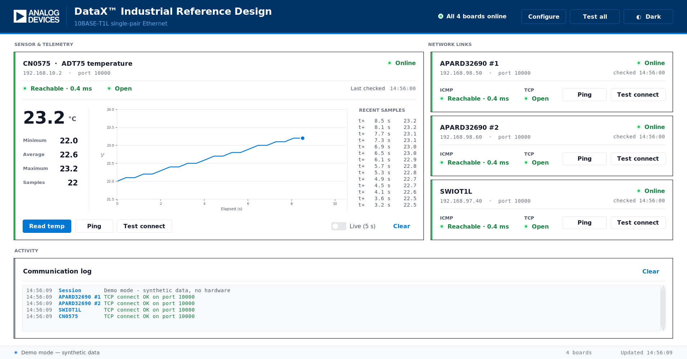
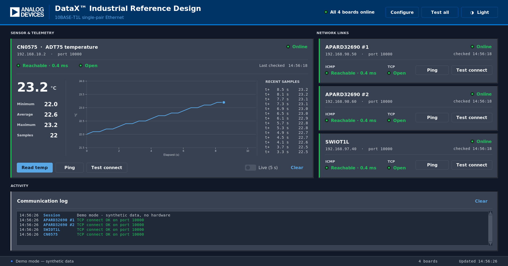
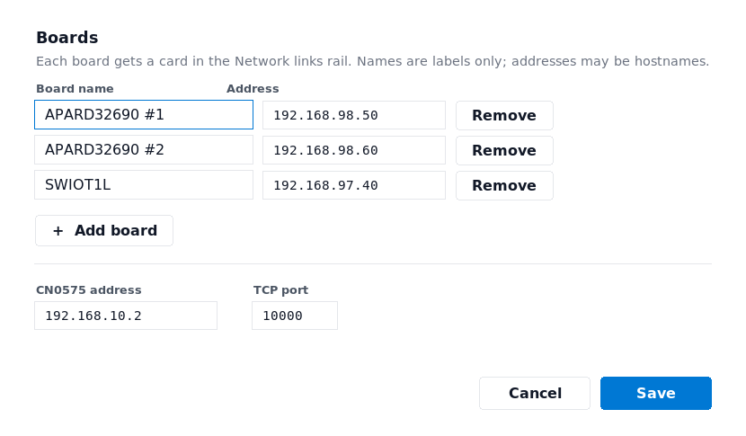

# ADI DataX&trade; — 10BASE-T1L Industrial Reference Design

A desktop control panel for the Analog Devices DataX&trade; 10BASE-T1L
single-pair Ethernet reference design. It discovers the boards on the T1L
network, verifies each one's command port, and plots live temperature from the
CN0575 (ADT75) sensor node.



<details>
<summary>Dark theme</summary>


</details>

This is the trimmed companion app: connectivity plus the CN0575 only. The
servo, colour-sensor, SWIOT1L fan and ADXL355 vibration panels live in the full
reference design app.

## What it does

- **Network links** — ICMP ping and a TCP connect check against each board's
  command port, with per-board state and a fleet roll-up in the header.
- **Sensor & telemetry** — the current ADT75 reading as a hero figure, running
  minimum / average / maximum / count, a trend chart, and a table of recent
  samples so every plotted value is also readable as a number.
- **Activity** — a timestamped log of every request and response, colour-coded
  by outcome.
- **Configuration** — board names and addresses, the sensor address and the
  port are editable from the header's *Configure* button, applied without a
  restart and saved to JSON.

## Requirements

- **Linux.** The ICMP check shells out to `ping` with iputils flags
  (`-c count`, `-W timeout` in seconds). BSD/macOS read `-W` as *milliseconds*
  and Windows spells the flags `-n`/`-w`, so those platforms need a branch in
  `ping_host()` that is deliberately not there. The TCP check and the sensor
  readout are portable; only ICMP is not.
- **Python 3.7 or newer** with `tkinter`. 3.7 is the floor because the board
  order you configure is the insertion order of a dict, which is only
  guaranteed from 3.7 on. Some distributions package Tk separately:
  ```sh
  sudo apt install python3-tk        # Debian / Ubuntu
  ```
- **Optional:** `matplotlib` for the trend chart, `Pillow` for smooth logo
  scaling. The app runs fully without either.

```sh
pip3 install -r requirements.txt
```

Both are needed only by the control panel in `RPI_T1LPSE/`. The CN0575
command server in `RPI_CN0575/` uses nothing outside the standard library, so
that Pi needs no `pip3` step at all.

## Quick start

Try it with no hardware attached:

```sh
python3 RPI_T1LPSE/datax-industrial.py --demo
```

Then point it at your own boards:

```sh
python3 RPI_T1LPSE/datax-industrial.py \
    --board "APARD32690 #1=10.0.0.5" \
    --board "APARD32690 #2=10.0.0.6" \
    --cn0575 10.0.0.9 \
    --port 10000
```

## Configuring your network

Nothing is hard-coded into the UI. The shipped defaults describe the reference
setup, and anyone bringing this up on their own bench will be on a different
subnet, so all three network values are user-supplied.

| Flag | Meaning |
|---|---|
| `--board NAME=IP` | A board to monitor. Repeatable. **Any use replaces the built-in list** rather than adding to it, so you never end up pinging the shipped defaults alongside your own. |
| `--cn0575 IP` | The CN0575 / ADT75 sensor node. |
| `--port N` | TCP command port, shared by every board. |
| `--config FILE` | The same three settings as JSON. |

Addresses may be IPv4 literals, IPv6 literals, or hostnames — anything
resolvable through DNS, mDNS or `/etc/hosts`. A typo is reported at startup
rather than surfacing later as a mystery timeout.

For a bench you return to, keep a config file:

```json
{
  "boards": {
    "APARD32690 #1": "10.0.0.5",
    "APARD32690 #2": "10.0.0.6",
    "SWIOT1L":       "10.0.0.7"
  },
  "cn0575": "10.0.0.9",
  "port": 10000
}
```

```sh
python3 RPI_T1LPSE/datax-industrial.py --config bench.json
```

Precedence is **command line > config file > defaults**, so a saved config can
be kept for the bench and overridden for a single run:

```sh
python3 RPI_T1LPSE/datax-industrial.py --config bench.json --port 10001
```

### Editing it from the app

The header's **Configure** button opens the same three settings as a form:
board names and addresses, add and remove boards, the sensor address and the
port. Values are held to the same validation as the command line, and nothing
is written until all of them pass — an address that will not resolve or a
port outside 1-65535 marks its own field and says why.



Saving applies the change to the running window — no restart. Renaming a board
retitles its card and keeps its check results; changing an address drops that
card back to *Not checked*, because a latency measured against the previous
host says nothing about the new one.

Save writes to whichever file the session is using:

| Launched with | Save writes to |
|---|---|
| `--config FILE` | that file |
| no `--config` | `$XDG_CONFIG_HOME/datax-industrial/boards.json`, or `~/.config/datax-industrial/boards.json` |

That default is also read at startup when it exists, which is how edits come
back on the next launch. It is absent on a first run, and that is not an
error — unlike a `--config` file you named that is not there, which is
reported as the typo it probably is.

Command-line flags still win over both, so `--board` overrides a saved file
for that run. The edit you then save is the full board list as the form shows
it, flags included.

## All options

| Option | Default | Notes |
|---|---|---|
| `--demo` | off | Synthetic data for every panel; no hardware needed. |
| `--theme {light,dark}` | `light` | Switchable at runtime too. |
| `--board NAME=IP` | three APARD/SWIOT1L boards | Repeatable; replaces the default list. |
| `--cn0575 IP` | `192.168.10.2` | Sensor node address. |
| `--port N` | `10000` | TCP command port. |
| `--config FILE` | `~/.config/datax-industrial/boards.json` | JSON with `boards` / `cn0575` / `port`. Also where *Configure* saves. |
| `--ping-count N` | `1` | ICMP echo count per check. |
| `--ping-timeout S` | `1.0` | ICMP echo timeout, seconds. |
| `--ui-scale F` | autodetect | Override the UI density factor. |
| `--custom-titlebar` | off | See *Window chrome* below. |

### Keyboard

| Key | Action |
|---|---|
| `Ctrl+R` / `F5` | Test all boards |
| `Ctrl+T` | Toggle light / dark theme |
| `Ctrl+L` | Clear the activity log |
| `Return` | Save — in the Configure dialog |
| `Esc` | Cancel — in the Configure dialog |

## What the boards have to implement

The app is a plain TCP client. Each board listens on the command port
(`--port`, default 10000) and answers one newline-terminated ASCII command per
connection:

| Request | Response | Used by |
|---|---|---|
| *(connect, then close)* | — | The TCP connect check; opening the socket is the whole test. |
| `READ_TEMP\n` | `TEMP:<celsius>\n`, e.g. `TEMP:23.4` | The CN0575 sensor card. |

Anything that is not a `TEMP:` reply with a parsable float is ignored rather
than displayed, so a board that is up but not yet answering correctly shows as
reachable with no reading — not as a crash or a bogus value. That is also what
makes the server's own error replies safe: they are reported, not plotted.

### The CN0575 command server

`RPI_CN0575/cn0575_state_machine.py` is a working implementation of the above,
for the EVAL-CN0575-RPIZ. Copy it to that Pi and run it:

```sh
python3 cn0575_state_machine.py
```

It listens on `0.0.0.0:10000` — matching the app's default port — and serves
one command per connection, logging each request and response to stdout. Only
the standard library is required.

| Request | Response |
|---|---|
| `READ_TEMP` | `TEMP:23.4` |
| `READ_TEMP`, sensor unreadable | `ERR:SENSOR_FAIL` |
| anything else | `ERR:UNKNOWN_CMD` |

Commands are matched case-insensitively after stripping whitespace.

Reading the ADT75 is attempted three ways, in order, so the same script works
across driver setups:

1. **IIO sysfs** — scans `/sys/bus/iio/devices/iio:device*/name` for `adt75`
   and converts `in_temp_raw × in_temp_scale`. This is the path you get on
   Kuiper Linux with the `rpi-cn0575` overlay.
2. **hwmon** — the first `/sys/class/hwmon/hwmon*/temp1_input`, in
   millidegrees.
3. **Direct I²C** — `smbus2` against address `0x48`, decoding the ADT75's
   12-bit two's-complement register at 0.0625 °C per LSB.

If all three fail it answers `ERR:SENSOR_FAIL`, which the app logs and shows
as a reachable board with no reading.

Two limits worth knowing before you build on it: it is single-threaded with a
backlog of one, so it serves one client at a time, and it reads once per
connection rather than framing a stream. That suits this app's one-shot
request pattern and is not a general-purpose server.

## Display scaling

The window sizes itself to the monitor it opens on and derives one density
factor from that monitor's height, normalised by the DPI the X server reports.
Everything — type scale, spacing, corner radii, chart dpi — is expressed
against that factor, so the UI keeps its proportions from a 1080p panel up to
a 4K one instead of rendering at a third of its intended size. Override with
`--ui-scale` if the autodetected value does not suit your display.

## Window chrome

By default the app uses your window manager's title bar. `--custom-titlebar`
replaces it with a thicker bar drawn by the app, with its own
minimise / maximise / close, drag-to-move, double-click-to-maximise and a
resize grip in the status bar.

The trade is explicit: an override-redirect window gives up WM snapping and
edge-resize, and on some window managers its taskbar entry and alt-tab slot as
well. That is why it is opt-in.

## Architecture

The repository is organised by deployment target: each `RPI_*` directory is
what you copy onto one Raspberry Pi.

| Path | Role |
|---|---|
| `RPI_T1LPSE/datax-industrial.py` | The control panel: network helpers, panels, window. Runs on the host or the T1L PSE Pi. |
| `RPI_T1LPSE/design_system.py` | Visual language — palette, light/dark themes, spacing scale, `Button`, `Card`, `TextField`, `ThemeMixin`. Imported by the app, and the two files must stay together. |
| `RPI_T1LPSE/assets/` | The Analog Devices logo (1x and 2x), resolved relative to the app file. |
| `RPI_CN0575/cn0575_state_machine.py` | The board-side command server for the EVAL-CN0575-RPIZ. See *The CN0575 command server* below. |
| `docs/` | Screenshots used by this README. |

Layout is two columns — telemetry and a board rail — above a full-width
activity log. A full-width chart on a 16:10 screen can only ever be a flat
band around 7:1, and buying it height starves every other panel; its own
column gets it near 2:1 and frees the height the log needs. Row and column
weights divide the space, so the proportions survive a resize or a different
screen.

Colour is not decoration here. Status text is per-theme because the shade that
clears 4.5:1 on a white card does not clear it on a dark one; every themed text
pair is held at or above that ratio, and the measured figures are recorded in
the comments beside each token in `design_system.py`. `text_dis` is reserved
for genuinely inactive controls, which WCAG exempts; use `muted` for real but
tertiary text.

## Troubleshooting

**Every board shows "Unreachable".** Check you are on the T1L subnet and that
your addresses are right (`--board`, `--cn0575`). Unprivileged ICMP needs
`net.ipv4.ping_group_range` to include your group on some distributions; if
ping is restricted, the TCP connect check still works and is the more
meaningful liveness signal.

**No chart.** `matplotlib` is not installed — `pip3 install -r
requirements.txt`. Everything else in the sensor card still works.

**My saved edits did not come back.** Command-line flags outrank the saved
file, so launching with `--board` or `--port` overrides it for that run — the
window shows the flags, not what you saved. Drop the flags, or pass
`--config FILE` and save into that file instead.

**Configure will not save.** The dialog reports the reason on its own error
line rather than closing. A read-only home or an unwritable `--config` path
is the usual cause; the previous file is left intact either way, because the
new one is written alongside it and moved into place only once complete.

**Configure is greyed out or does nothing.** It refuses to open while checks
are still in flight — wait for *Test all* to finish. Reconfiguring mid-check
would land results on a card that had already changed address.

**The UI is too large or too small.** Pass `--ui-scale`, e.g. `--ui-scale 1.0`
for native sizing or `--ui-scale 2` on a high-density panel the X server
reports as 96 DPI.

**It opens across two monitors.** It shouldn't — the window is sized to the
monitor it opens on via `xrandr`. If `xrandr` is unavailable the app falls back
to the full X screen, which on a multi-head desktop is every monitor side by
side.
